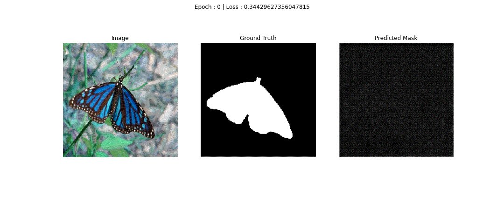

### Butterfly Segmentation In Wild 🦋
___

&nbsp;&nbsp;&nbsp;&nbsp;&nbsp;&nbsp;&nbsp;

&nbsp;&nbsp;&nbsp;&nbsp;&nbsp;&nbsp;

&nbsp;&nbsp;&nbsp;&nbsp;&nbsp;&nbsp;

&nbsp;&nbsp;&nbsp;&nbsp;&nbsp;&nbsp;

___

> Dataset Link : [Kaggle](https://www.kaggle.com/veeralakrishna/butterfly-dataset)

> Results

#### Convolutional AutoEncoder 

* pretty much overfitting but i'll cross validate it later.

> Epoch Results 

> Loss Over Epochs 

___

#### U-Net

* pretty much overfitting but i'll cross validate it later.

> Epoch Results 

> Loss Over Epochs 

> And Finally The Architecture Used.

